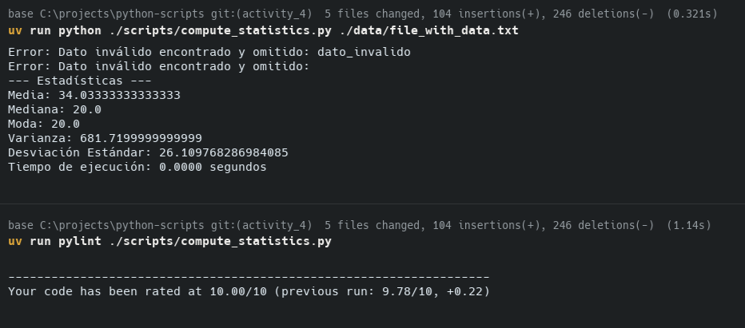
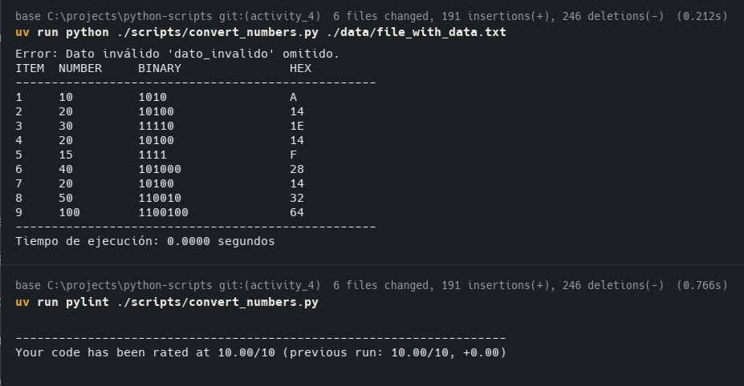
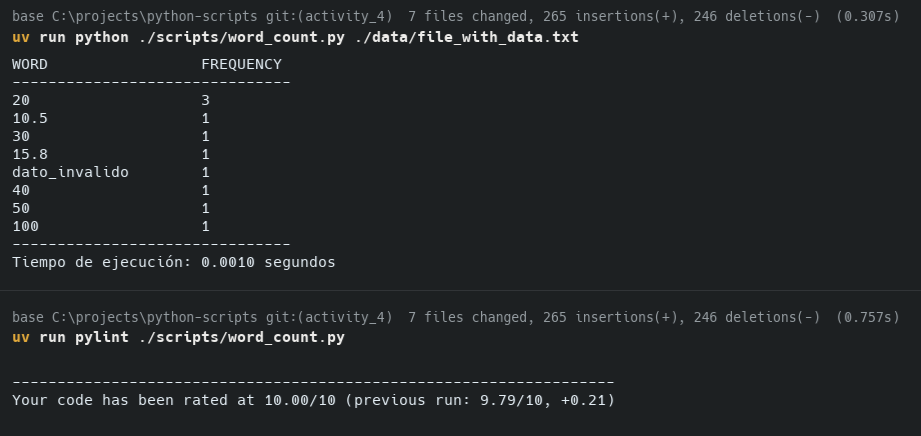

# Actividad A4.2: Programación en Python y Estándares de Codificación

Este repositorio contiene la solución a tres ejercicios de programación en Python, desarrollados bajo el estándar **PEP-8** y verificados con **Pylint** para asegurar la calidad del código.

## Estructura del Proyecto

* `scripts/`: Contiene los archivos fuente de Python.
    * `compute_statistics.py`: Calcula estadísticas descriptivas.
    * `convert_numbers.py`: Convierte números a binario y hexadecimal.
    * `word_count.py`: Cuenta la frecuencia de palabras.
* `data/`: Contiene los archivos de entrada y las evidencias de ejecución.
    * `file_with_data.txt`: Archivo con datos de prueba.
    * `*_pylint.png`: Capturas de pantalla con la calificación de Pylint.
* `*.txt`: Archivos de resultados generados por los scripts (se crean tras la ejecución).

---

## 1. Compute Statistics (`compute_statistics.py`)

Este programa lee un archivo con números y calcula estadísticas descriptivas básicas (Media, Mediana, Moda, Varianza, Desviación Estándar) sin utilizar librerías matemáticas externas.

**Ejecución:**
```bash
python scripts/compute_statistics.py data/file_with_data.txt

```

**Resultados:**
Los resultados se muestran en consola y se guardan en `StatisticsResults.txt`.

* Maneja datos inválidos ignorándolos y notificando al usuario.
* Muestra el tiempo de ejecución al final.

**Calidad de Código (Pylint):**
El código cumple con todos los estándares PEP-8, obteniendo una calificación perfecta.



---

## 2. Convert Numbers (`convert_numbers.py`)

Programa que lee números de un archivo y los convierte a sus representaciones en **Binario** y **Hexadecimal** utilizando algoritmos básicos de división sucesiva (sin funciones integradas como `bin()` o `hex()`).

**Ejecución:**

```bash
python scripts/convert_numbers.py data/file_with_data.txt

```

**Resultados:**
Los resultados se muestran en consola y se guardan en `ConvertionResults.txt`.

* Soporta números negativos y decimales (truncándolos a enteros).
* Reporta el tiempo de procesamiento.

**Calidad de Código (Pylint):**
Verificación de estándares de codificación y complejidad ciclomática.



---

## 3. Word Count (`word_count.py`)

Lee un archivo de texto, identifica las palabras distintas y calcula la frecuencia de aparición de cada una.

**Ejecución:**

```bash
python scripts/word_count.py data/file_with_data.txt

```

**Resultados:**
Los resultados se muestran en consola y se guardan en `WordCountResults.txt`.

* Maneja errores de lectura de archivos.
* Limpia signos de puntuación básicos para un conteo más preciso.

**Calidad de Código (Pylint):**
El script sigue las convenciones de nomenclatura y estructura de Python.



---

## Requisitos Técnicos Cumplidos

* [x] **Línea de comandos:** Todos los programas reciben el archivo como parámetro.
* [x] **Manejo de Errores:** Se capturan datos inválidos y archivos inexistentes sin romper la ejecución.
* [x] **Algoritmos Básicos:** No se utilizan librerías externas para los cálculos (solo `sys` y `time`).
* [x] **Salida Dual:** Los resultados se imprimen en pantalla y se guardan en archivos `.txt`.
* [x] **Rendimiento:** Se mide y reporta el tiempo de ejecución.
* [x] **PEP-8:** Código validado con Pylint (Score: 10/10).

## Autor

- **Matrícula:** A00517113
- **Nombre:** Alejandro Gonzalez Almazan