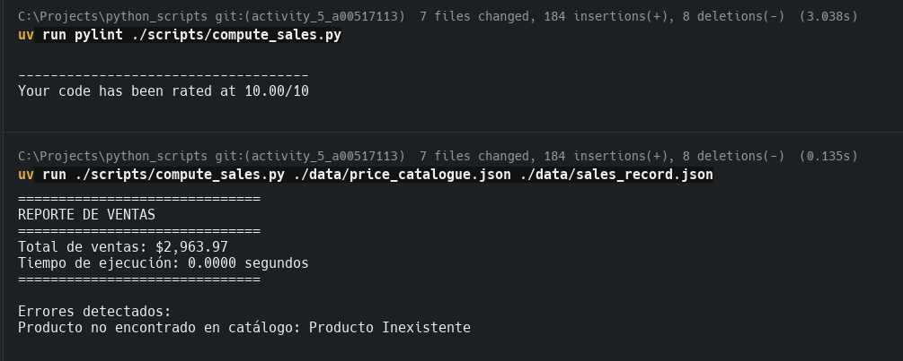

# Actividad A5.2: Programación en Python - Sistema de Cálculo de Ventas

Este repositorio contiene la solución para el sistema de gestión de ventas desarrollado bajo el estándar **PEP-8**, validado con **Pylint** y ejecutado mediante el gestor de entornos **uv**.

## Estructura del Proyecto

* `scripts/`: Contiene el código fuente.
* `compute_sales.py`: Script principal que procesa catálogos y registros de ventas.


* `data/`: Archivos de entrada en formato JSON.
* `price_catalogue.json`: Catálogo maestro de productos y precios.
* `sales_record.json`: Registro de transacciones de ventas.


* `SalesResults.txt`: Reporte generado automáticamente con el total y el tiempo de ejecución.

---

## 1. Compute Sales (`compute_sales.py`)

Este programa realiza el cruce de información entre un catálogo de precios y un registro de ventas para determinar el costo total de la operación de una empresa.

### Requisitos Técnicos Cumplidos:

* [x] **Invocación:** El programa recibe dos archivos JSON por línea de comandos.
* [x] **Manejo de Errores:** Gestiona datos inválidos, archivos inexistentes y productos no encontrados en el catálogo sin detener la ejecución.
* [x] **Salida Dual:** Resultados legibles en consola y exportados a `SalesResults.txt`.
* [x] **Rendimiento:** Optimizado para manejar desde cientos hasta miles de registros.
* [x] **Métrica de Tiempo:** Reporta el tiempo transcurrido del proceso al finalizar.

### Ejecución con `uv`:

Para ejecutar el programa utilizando el gestor `uv`, utiliza el siguiente comando:

```bash
uv run ./scripts/compute_sales.py ./data/price_catalogue.json ./data/sales_record.json

```

---

## 2. Calidad de Código y Estándares

El código ha sido verificado para cumplir estrictamente con **PEP-8**, asegurando legibilidad y mantenimiento a largo plazo.

**Validación con Pylint:**

```bash
uv run pylint ./scripts/compute_sales.py

```

Resultados:
```log
uv run ./scripts/compute_sales.py ./data/price_catalogue.json ./data/sales_record.json
==============================
REPORTE DE VENTAS
==============================
Total de ventas: $2,963.97
Tiempo de ejecución: 0.0000 segundos
==============================
```



Errores detectados:
Producto no encontrado en catálogo: Producto Inexistente


**Resultado:** `Your code has been rated at 10.00/10`

---

## Autor

* **Matrícula:** A00517113
* **Nombre:** Alejandro Gonzalez Almazan

---
